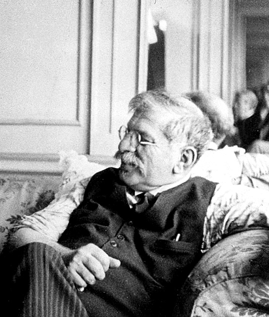

# progress-timeline

## *Love and compassion are necessities, not luxuries. Without them, humanity cannot survive* - __Dalai Lama__

This Repository will be dedicated to timeline of LGBTQ+, where we will do our best to represent impact they have made to our world throughout history and how world has impacted them. There is numerous facts of history, what has happened to people, who think, believe or love in different way, not according to society standards of that time. And no matter how world was cruel to them, they still loved and shared it to world. There is enormous number of famous quotes, but at this point i remember this one:

*It takes great deal of courage to see the world in its tainted glory, and still to love it* - __Oscar Wilde.__

Oscar Wilde is well known writer, who had to suffer just because of his love, love to man. and he was not alone, there were many, many others... But there was a time, when our society had to change, and those changes were made. 

  
 Magnus Hirschfeld founds the Scientific-Humanitarian Committee (WhK), one of the first gay rights organizations. 1910s:

The committee was established in Germany on May 15, 1897, shortly after Magnus Hirschfield secured the release of Oscar Wilde, who had been imprisoned for homosexuality. Hirschfield noticed the alarming number of his homosexual patients contemplating suicide due to societal condemnation of their natural desires. In an effort to challenge the prevailing belief that homosexuality was unnatural and criminal, they collected over 5,000 signatures, including those of prominent figures such as Leo Tolstoy and Albert Einstein, advocating for the repeal of Paragraph 175, the law that criminalized same-sex relationships.  
<a  href="https://commons.wikimedia.org/wiki/File:Jahrbuch_für_sexuelle_Zwischenstufen_-_1899.jpeg">Link to source and Copyright rules</a>

 1919: Magnus Hirschfeld opens the Institute for Sexual Research in Berlin, promoting the understanding and acceptance of homosexuality. 

On July 6th, Magnus Hirschfield inaugurated the groundbreaking "Institute of Sexual Science" in Berlin's Tiergarten district, making it the world's first institution of its kind. With a diverse team of over 40 professionals specializing in research, sexual counseling, venereal disease treatment, and public sexual education, the institute also featured a museum showcasing sexual artifacts, examination rooms, and a lecture hall. Providing free advice to the public, the institute conducted over 18,000 consultations in its inaugural year, benefiting more than 3,500 individuals. Those with limited financial resources received complimentary medical treatment at the institute. 
<a href="https://commons.wikimedia.org/wiki/File:Berlin_hirschfeld_gedenktafel.jpg">Source and Copyright rules</a>

  
 1924: The Society for Human Rights is established in Chicago, marking the first recognized gay rights organization in the United States. 

Inspired by Magnus Hirschfield, Henry Gerber, originally from Bavaria and later a resident of the United States, submitted an application to establish the Society for Human Rights on December 10, 1924, in Chicago. Although he published only a few issues before the local police presented a charter that led to the society's closure in 1925, the charges were eventually dropped. Unfortunately, Gerber was financially ruined due to the legal fees. Despite these setbacks, he persevered and continued to write about homosexuality for various publications.  
<a href="https://commons.wikimedia.org/wiki/File:Former_Location_of_the_Society_for_Human_Rights,_1701_N._Crilly_Court,_Chicago_2015.jpg">Source and Copyright Rules</a>

 1933: The Nazi regime in Germany initiates the persecution of LGBTQ+ individuals, leading to arrests, imprisonment, and violence.

During the Nazi regime, a student group aligned with the regime marched to the Institute for Sexual Science, looting its library and archives, followed by the burning of books and files. Within months, the institute was compelled to close. Henry Gerber, affected by these events, left Germany and relocated to France. The Nazi regime continued its relentless campaign against male homosexuality from 1933 to 1945, resulting in over 100,000 arrests and approximately 50% of them being convicted, often leading to imprisonment in concentration camps. In June 1935, the Nazis intensified their efforts by amending Paragraph 175, effectively banning sexual relationships between men. The campaign further escalated in 1936 under the leadership of SS leader Heinrich Himmler.  
<a href="https://picryl.com/media/institut-fur-sexualwissenschaft-bibliothek-1933-4207a6"> Link to source and Copyright rules</a>

  
 1948: Alfred Kinsey publishes “Sexual Behavior in the Human Male,” a groundbreaking study that includes research on homosexuality. 1950s 

Alfred Kinsey, a renowned sexologist, gained recognition for his groundbreaking work on human sexuality. He proposed that everyone falls on a bisexual scale ranging from 0 (heterosexual) to 6 (homosexual). Kinsey published two influential books known as "The Kinsey Reports":

In 1948, "Sexual Behavior in the Human Male" was released, based on 5,300 interviews.
In 1953, "Sexual Behavior in the Human Female" followed, based on 6,000 interviews.

Through his research, Kinsey discovered that approximately 11.6% of males aged 20-35 fell at rating 3 on his scale, indicating some level of bisexuality. The corresponding figure for females was approximately 7%. These findings challenged prevailing societal notions of sexual orientation.  
<a href="https://openlibrary.org/books/OL6029395M/Sexual_behavior_in_the_human_male#editions-list">Book: Sexual Behavior in the Human Male</a>

 
1952: The American Psychiatric Association includes homosexuality in the first edition of the Diagnostic and Statistical Manual of Mental Disorders (DSM).

This manual had the objective of establishing consistent criteria and terminology for psychiatric disorders, resulting in the classification of homosexuality as a "sociopathic personality disturbance." It encompassed various forms of sexual deviation, such as "homosexuality, transvestism, fetishism, and others." The inclusion of these behaviors in the Diagnostic and Statistical Manual of Mental Disorders (DSM) aimed to acknowledge them as disorders rather than moral transgressions. This laid the groundwork for future investigations on homosexuality by clinicians, shaping the understanding and study of this topic in the field of psychology. 

1969: The Stonewall riots in New York City ignite the modern LGBTQ+ rights movement, marking a turning point for activism.

The Stonewall Inn was a well-known gay bar where individuals could gather to socialize, dance, and enjoy the jukebox. The establishment had Mafia "protection" through regular payoffs, as the Mafia had invested in the bar. The police raided the bar, suspecting involvement in bootlegging liquor. Patrons were required to present identification, and those who were not arrested were escorted out. A crowd began to gather outside, and as more people arrived, they were met with thrown beer bottles. Gradually, the situation escalated into a riot, with some arrested individuals being freed by the enraged crowd. The following night, although smaller confrontations between the LGBTQ+ community and the police occurred, the riot had subsided. Those who were present became members of the Gay Liberation Front, continuing to fight for the rights and equality of the queer community. 
<a href="https://commons.wikimedia.org/wiki/File:The_Plaque_at_Stonewall_Inn.jpg">Link to Source and Copyright rules</a>

1973: The American Psychiatric Association removes homosexuality from the list of mental disorders in the DSM.

In 1973, the American Psychiatric Association (APA) voted on the removal of homosexuality from the list of mental disorders. Out of the votes cast, 5,854 were in favor of removal, while 3,810 were in favor of retaining the classification. This decision led to homosexuality being shifted from the Diagnostic and Statistical Manual (DSM), and instead labeled as "sexual orientation disturbance" until its complete removal in 1987. However, it is worth noting that the new definition proposed by Spitzer was criticized for its homophobic bias. Years later, Spitzer publicly resigned from the APA nomenclature committee due to the recognition of his own homophobic views.

The first cases of what would later be identified as AIDS are reported, leading to a devastating impact on the LGBTQ+ community.

On June 5, 1981, the Centers for Disease Control and Prevention (CDC) published a report highlighting five cases of Pneumocystis Pneumonia among gay men, although the disease was already known within the LGBT+ community. Lawrence Mass, a journalist, was the first to write about the emerging epidemic in an article titled "Disease Rumors Largely Unfounded" published in the gay newspaper The New York Native. By the end of 1981, there were already 270 reported cases of severe immune deficiency, with 121 deaths among gay men. At this point, the disease was still not fully understood and lacked an official name. Finally, on September 24, the CDC named it AIDS (Acquired Immune Deficiency Syndrome). By 1985, at least one HIV infection had been reported in every region of the world.

1996: President Bill Clinton signs the Defense of Marriage Act (DOMA), which denies federal recognition of same-sex marriages.

Bill Clinton signed the Defense of Marriage Act (DOMA), which defined marriage as exclusively between one man and one woman, granting states the power to reject recognition of same-sex marriages. Consequently, this resulted in the denial of federal protections, privileges, access to employment benefits for partners, inheritance rights, immigration and residency rights, and complications with joint tax returns. In summary, a single stroke of a pen by one individual eliminated the rights of millions of people, effectively erasing their ability to enjoy equal treatment and opportunities in various aspects of life. 
<a href="https://commons.wikimedia.org/wiki/File:President_William_J._Clinton_Signing_Line_Item_Veto_Letters_-_NARA_-_77861673.jpg">Source and Copyright Rules</a>

The Supreme Court of the United States strikes down sodomy laws in Lawrence v. Texas, decriminalizing same-sex sexual activity.

A significant turning point came in 2003 with the landmark case Lawrence v. Texas, which resulted in the decriminalization of homosexuality throughout the United States, although by then only 36 states had repealed their anti-sodomy laws. However, Louisiana continued to classify same-sex relations as a crime under its legal definition. It was not until June 26, 2005, with the case Obergefell v. Hodges, that marriage equality became the law of the land in all 50 states. American Samoa took an additional two years to follow suit. This marked the beginning of a transformative journey towards greater LGBTQ+ rights and recognition. 
<a href="https://commons.wikimedia.org/wiki/File:First_Roe,_then_Obergefell,_then_Lawrence%3F.jpg">Link to source and Copyright Rules </a>

The “Don’t Ask, Don’t Tell” (DADT) policy, which prohibited openly gay individuals from serving in the U.S. military, is repealed.

The "Don't Ask, Don't Tell" (DADT) policy, which suppressed the rights of gay, lesbian, and bisexual individuals, was finally terminated on September 20, 2011. Under DADT, they were compelled to conceal their sexual orientation, as any acknowledgment of their identity or engagement in "homosexual conduct" could result in discharge from the military. The abolishment of this policy marked a significant milestone, providing protection against discrimination for gay servicemen and servicewomen. This change allowed them to serve openly without fear of reprisal based on their sexual orientation, fostering a more inclusive and equitable environment within the military. 
<a href="https://commons.wikimedia.org/wiki/File:Protest_Against_DADT_%285105546286%29.jpg"> Link to source and Copyright rules</a>

2020: The Supreme Court of the United States rules in Bostock v. Clayton County that federal employment discrimination protections extend to LGBTQ+ individuals.

The Civil Rights Act in the United States was designed to safeguard employees against discrimination, but its application varied across states, with only 21 providing comprehensive protection. However, when Gerald Bostock expressed interest in a gay softball league, he was terminated from his job in Clayton County, Georgia. The subsequent court ruling established that it is unlawful for employers to discriminate against individuals based on their transgender status or sexual orientation, as protected by Title VII and the Civil Rights Act of 1964. This landmark victory represents a significant milestone for the LGBTQ+ community, affirming that people should not be judged based on their identity or whom they love.  
<a href="https://commons.wikimedia.org/wiki/File:Gerald_Bostock_Supreme_Court_October_8_2019.jp">Source and Copyright rules </a>

  
<h1>Artists:</h1>

Frida Kahlo

Frida Kahlo, the Mexican painter, left an indelible mark on the art world and LGBTQ+ representation. Known for her vibrant self-portraits, Kahlo explored themes of identity, gender, and sexuality. Her art often depicted her own experiences and challenges, including her bisexuality and her relationships with both men and women. Kahlo's work challenged societal norms and celebrated individuality and self-expression. She became an icon for embracing one's true self and for the powerful representation of queer identities in art. Frida Kahlo's unique artistic style and her unapologetic exploration of her own truth continue to inspire and resonate with audiences around the world.

Keith Haring

Keith Haring, the American artist and activist, was a trailblazer in the art world and a champion for LGBTQ+ rights. Through his iconic, vibrant, and accessible artwork, Haring addressed themes of love, unity, and social justice. As an openly gay artist during the height of the AIDS crisis, Haring used his platform to raise awareness about the disease and advocate for safe sex practices. His bold, graffiti-inspired imagery became synonymous with the 1980s New York City art scene and has since become globally recognized. Keith Haring's legacy as an artist and activist continues to inspire generations, leaving an enduring impact on both the art world and LGBTQ+ advocacy.
<a href="https://commons.wikimedia.org/wiki/File:Keith_Haring_1986.jpg">Source and Copyright rules</a>

Marsha P. Johnson

Marsha P. Johnson was an influential transgender rights activist and key figure in the LGBTQ+ liberation movement. As a prominent participant in the 1969 Stonewall uprising, Johnson's activism played a pivotal role in igniting the fight for LGBTQ+ rights. She co-founded Street Transvestite Action Revolutionaries (STAR), a group that provided support and advocacy for homeless transgender youth. Johnson's tireless efforts and advocacy made her a beacon of hope and resilience for marginalized communities. Her visibility, courage, and unwavering dedication to justice and equality continue to inspire and empower LGBTQ+ individuals today. Marsha P. Johnson's legacy as an icon and trailblazer will forever be celebrated.

David Bowie

David Bowie, the legendary British musician and actor, left an indelible mark on both the music industry and LGBTQ+ representation. Known for his chameleon-like personas and boundary-pushing artistry, Bowie challenged conventional norms of gender and sexuality. His iconic androgynous style and exploration of fluid identities through his music and stage presence opened doors for queer expression and acceptance. Bowie's alter ego Ziggy Stardust became an emblem for the LGBTQ+ community, embracing nonconformity and encouraging self-expression. Through his art, Bowie transcended boundaries, inspiring generations to embrace their true selves and celebrating the beauty of individuality. His influence on music and LGBTQ+ culture is immeasurable. 
<a href="https://commons.wikimedia.org/wiki/File:David_Bowie_(1987).jpg">Source and Copyright Rules</a>

Jean-Michel Basquiat

Jean-Michel Basquiat, the influential American artist, made an indelible mark on the art world and LGBTQ+ representation. Known for his raw and expressive style, Basquiat explored themes of identity, race, and sexuality. As an openly gay artist of Haitian and Puerto Rican descent, Basquiat challenged the status quo and broke barriers in the predominantly white art scene of the 1980s. His bold and vibrant artwork captured the attention of the art world, elevating street art to the realm of high art. Basquiat's legacy as a queer artist and his unique ability to convey powerful social messages through his art continue to inspire and captivate audiences worldwide. 
<a href="https://commons.wikimedia.org/wiki/File:Jean-Michel_Basquiat_by_Miguel_Rodez_2016.jpg">Source and Copyright Rules</a>

Audre Lorde

Audre Lorde, the African American writer, poet, and activist, made a profound impact on literature, feminism, and LGBTQ+ representation. Lorde's powerful and unapologetic writings delved into intersectional feminism, racism, and lesbian identity. Through her poetry and essays, she shed light on the experiences of marginalized communities, emphasizing the importance of embracing and celebrating one's unique identity. Lorde's work challenged societal norms and advocated for social justice and equality. As an openly lesbian woman of color, she became a prominent voice for the LGBTQ+ community, inspiring generations with her eloquence, courage, and unwavering commitment to creating a more inclusive and equitable world. 
<a href="https://commons.wikimedia.org/wiki/File:Audre_Lorde_und_May_Ayim.jpg">Source and Copyright Rules</a>

Ellen DeGeneres

Ellen DeGeneres, the beloved American comedian, actress, and TV host, has been a trailblazer for LGBTQ+ representation in the entertainment industry. After coming out as a lesbian in 1997, she faced significant backlash, but her authenticity and resilience paved the way for greater visibility and acceptance. Her groundbreaking sitcom "Ellen" became the first prime-time show to feature an openly gay lead character. Since then, DeGeneres has become a powerful advocate for LGBTQ+ rights and a symbol of love, inclusivity, and kindness. Her immense popularity and influential platform have helped shape public perceptions and promote understanding, making her an icon for the LGBTQ+ community. 
<a href="https://commons.wikimedia.org/wiki/File:Ellen_DeGeneres-2009-enh5.jpg">Source and Copyright Rules</a>

Laverne Cox 

Laverne Cox, the talented American actress and transgender rights advocate, has had a profound impact on the entertainment industry and LGBTQ+ visibility. Cox rose to prominence for her groundbreaking portrayal of Sophia Burset in the hit series "Orange Is the New Black." As a prominent transgender actress, she has used her platform to advocate for trans rights, raise awareness about the challenges faced by the trans community, and promote greater inclusivity in media. Cox's activism, eloquence, and grace have made her a powerful voice for trans representation and an inspiration for countless individuals, leaving a lasting legacy in the fight for LGBTQ+ equality.
<a href="https://commons.wikimedia.org/wiki/File:Laverne_Cox_at_SF_Trans_March_20150626-5862.jpg">Source and Copyright Rules</a>

Oscar Wilde

Oscar Wilde, the renowned Irish playwright, poet, and novelist, remains an iconic figure in literature and LGBTQ+ history. Known for his wit, flamboyance, and sharp social commentary, Wilde challenged Victorian conventions and embraced his queer identity with unapologetic flair. His plays, such as "The Importance of Being Earnest" and "The Picture of Dorian Gray," explored themes of identity, love, and societal hypocrisy. Wilde's tragic personal life and his subsequent imprisonment for "gross indecency" only solidified his status as a martyr for LGBTQ+ rights. His legacy as a literary genius and an advocate for individualism and self-expression continues to inspire and resonate today. 
<a href="https://pixabay.com/photos/oscar-wilde-portrait-irish-writer-1165545/">Source and Copyright Rules</a>

 Scientists

Alan Turing

Alan Turing, the brilliant British mathematician and computer scientist, played a pivotal role in the development of modern computing and artificial intelligence. His groundbreaking work in the early 20th century laid the foundation for the digital age we live in today. Turing's contributions to codebreaking during World War II, notably his work on the Enigma machine, helped shorten the war and saved countless lives. As an openly gay man in a time when homosexuality was criminalized, Turing faced persecution and tragedy. His legacy as a visionary scientist, pioneer of computer science, and symbol of resilience in the face of adversity continues to inspire and shape our world. 
<a href="https://commons.wikimedia.org/wiki/File:Turing_in_1935.jpg">Source and Copyright Rules"</a>

Harald zur Hausen

Harald zur Hausen's contributions to science and his research on human papillomavirus (HPV) and its link to cervical cancer did not directly address the perspective that gay individuals created AIDS. However, his work, along with other scientists, has helped challenge and debunk the misconceptions and stigmatizing beliefs surrounding the origins and transmission of HIV/AIDS. By identifying HPV as a separate virus with its own associated health risks, zur Hausen's research has contributed to a more accurate understanding of different viruses and their respective impacts on public health. This has played a part in dispelling unfounded notions linking HIV/AIDS exclusively to the gay community and promoting a more inclusive and evidence-based perspective on the disease. 
<a href="https://commons.wikimedia.org/wiki/File:Harald_zur_Hausen-press_conference_Dec_06th,_2008-5.jpg">Source and Copyright Rules</a>

 

Magnus Hirschfeld

Magnus Hirschfeld was a pioneering German physician and sexologist who made significant contributions to LGBTQ+ rights and understanding in the early 20th century. He co-founded the Scientific-Humanitarian Committee in 1897, one of the first LGBTQ+ organizations, advocating for the decriminalization of homosexuality and the rights of sexual minorities. Hirschfeld's research and writings challenged prevailing social norms and promoted a more compassionate and scientific understanding of diverse sexualities and gender identities. He also established the Institute for Sexual Research in Berlin, which provided support, education, and medical services to the LGBTQ+ community. Hirschfeld's work laid the foundation for future advancements in LGBTQ+ rights and remains influential in queer history and activism. 
<a href="https://commons.wikimedia.org/wiki/File:Magnus_Hirschfeld_1929.jpg">Source and Copyright Rules</a>

 

Alfred Kinsey 

Alfred Kinsey was an American biologist and sexologist who played a pivotal role in advancing our understanding of human sexuality. His groundbreaking research, particularly the Kinsey Reports published in the 1940s and 1950s, challenged prevailing societal beliefs about sexual behavior and orientation. Kinsey's studies, based on extensive surveys and interviews, revealed the diversity and fluidity of human sexuality, including same-sex behavior. His work not only provided valuable insights into sexual practices but also helped to destigmatize and humanize discussions around sexuality. By bringing scientific rigor to the study of human sexual behavior, Kinsey sparked a paradigm shift in how society approaches and understands human sexuality. 
<a href="https://commons.wikimedia.org/wiki/File:Alfred_Kinsey_1955.jpg">Source and Copyrght Rules</a>

 

Evelyn Hooker

Evelyn Hooker was an influential American psychologist who made significant contributions to the understanding of homosexuality. In the 1950s, at a time when homosexuality was widely pathologized, Hooker conducted groundbreaking research that challenged prevailing beliefs. Her study compared the psychological profiles of gay and straight men and found no significant differences in mental health, debunking the notion that homosexuality was inherently pathological. This research played a crucial role in the eventual removal of homosexuality as a mental disorder from the Diagnostic and Statistical Manual of Mental Disorders (DSM) by the American Psychiatric Association. Hooker's work paved the way for greater acceptance and understanding of homosexuality as a normal and healthy variation of human sexuality.

 

Susan Stryker

Susan Stryker is a prominent transgender historian, filmmaker, and gender theorist who has made substantial contributions to transgender studies and activism. Her work focuses on the intersection of gender, sexuality, and identity. Stryker co-directed the documentary film "Screaming Queens: The Riot at Compton's Cafeteria," which highlights the resistance of transgender women against police violence in 1966 San Francisco. She has also written influential texts on transgender history, including "Transgender History" which provides a comprehensive overview of the transgender experience throughout time. Stryker's scholarship has been instrumental in raising awareness, promoting understanding, and advocating for the rights of transgender individuals. 
<a href="https://commons.wikimedia.org/wiki/File:Trans_March_San_Francisco_20170623-6594.jpg">Source and Copyright Rules</a>

 

George Chauncey

George Chauncey is an esteemed historian and scholar known for his groundbreaking research on LGBTQ+ history. His seminal work, "Gay New York: Gender, Urban Culture, and the Making of the Gay Male World, 1890-1940," explored the history of gay life in early 20th-century New York City. Chauncey's research challenged prevailing notions and stereotypes about homosexuality by providing a comprehensive and nuanced understanding of the experiences of gay men in urban settings. His work has been instrumental in highlighting the historical struggles, contributions, and resilience of LGBTQ+ communities. Chauncey's scholarship continues to shape LGBTQ+ history and has paved the way for further research and social understanding. 
<a href="https://commons.wikimedia.org/wiki/File:George_Chauncey_(2000).jpg">Source and Copyright Rules</a>

## 🌈 Pride Representation 🥳

## Criteria
In this section, we will briefly discuss how our team addressed the applicable criteria:

- ✨ What Framework was used?
- ✨ How innovative is the idea and project?
- ✨ Was the README Template used and expanded upon?
- ✨ Was the GitHub Project used to plan and execute the project?
- ✨ Is the project completed and deployed?

## Intro 
This project aims to be a helpful resource to the LGBTQ+ movement. in order to fight prejudices and intolerance towards marginalized groups in our society we find that knowledge and education, together with love and support, are the best tools. The website of this project serves as both a source of knowledge about the hardships and obstacles that the movement has had to overcome thoughout modern history, as well as a platform for making LGBTQ+ voices heard and for offering support and inspiration to the members of the LGBTQ+ community.

Due to the importance of both education and support for this cause this project stretches over a few themes: namely Empowering Queer Voices and Fostering Inclusive Allyship by giving the users the incredibly valuable possibility of sharing their stories, and to be heard by others, who in turn can offer support and advice through the comment feature; and through knowledge and education by the LGBTQ+ timeline which offers an easy-to-grasp overview of the movement as well as more in-depth descriptions it helps to serve Advocacy and Activism for the community. 

## Goal

### Problem Statement: 

Prejudices can cause stigmas which are hard to overcome as a member of the LGBTQ+ community. It can lead to people feeling isolated and can have serious consequences. People need access to supportive social structures where they can feel seen and understood. 

### Objectives:

1. This website can through its LGBTQ+ timeline feature educate and inspire people so as to fight prejudices and help marginalized people feel part of the community.

2. Through the story feature users can empower themselves by posting their LGBTQ+ stories, sharing their experiences with others and help inspire other users with everyday examples of the joys and hardships that permeates the lives of people in the LGBTQ+ community. The comment feature can further help the users to a feeling of being part of something bigger than themselves and is a powerful way to connect people to offer support and advice to one another.

### Target audiences:

The primary target audience is people of all ages who are in some way part of the LGBTQ+ community. Secondary target audiences are knowledge seeking individuals or organizations such as schools or other learning institutions. 

### Benefits:

By giving the general public more education regarding the LGBTQ+ movement it will increase the understanding and acceptance of this marginalized group. Furthermore, the story and comment sections of the website can contribute with a safe environment which is essential to the well-being and in the identity-building process of people. 

## Tech
In the tech section, we provide information about the technology stack, dependencies, and any technical details related to the project.

## Credits
We would like to give credit to the following individuals, organizations, and resources that have contributed to the project or provided inspiration:
- 🙌 [Contributor 1]
- 🙌 [Contributor 2]
- 🌐 [External Resource 1]
- 🌐 [External Resource 2]